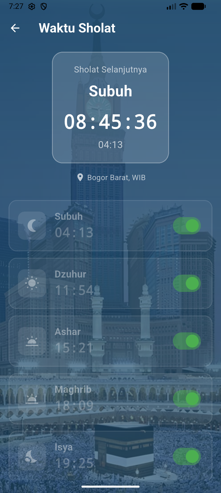
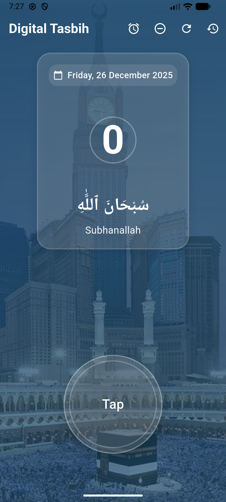
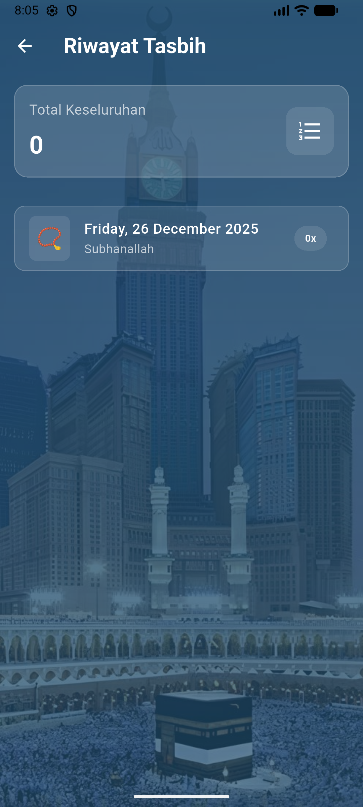

# 📿 Tasbih Digital - Aplikasi Tasbih & Waktu Sholat

Aplikasi Tasbih Digital dengan fitur alarm waktu sholat otomatis untuk Bogor Barat.

## ✨ Fitur Utama

- **📿 Digital Tasbih Counter** - Hitung dzikir dengan tap
- **🕌 Waktu Sholat Otomatis** - Untuk lokasi Bogor Barat (WIB)
- **⏰ Alarm Sholat** - Notifikasi untuk 5 waktu sholat
- **📊 Riwayat Dzikir** - Lihat histori dzikir harian
- **🎨 UI Islami** - Desain indah dengan tema Islamic

## 🕌 Waktu Sholat

Aplikasi ini menggunakan perhitungan waktu sholat akurat untuk:
- **Lokasi**: Bogor Barat, Indonesia
- **Timezone**: WIB (Asia/Jakarta)
- **Metode**: Singapore (sesuai Kemenag RI)
- **Madhab**: Shafi'i

### Fitur Waktu Sholat:
- ✅ Countdown otomatis ke sholat berikutnya
- ✅ Toggle alarm untuk setiap waktu sholat
- ✅ Notifikasi meskipun aplikasi tertutup
- ✅ Update otomatis setiap hari

## 📱 Screenshot

### Home Screen


### Prayer Times Screen


### History Screen


## 🛠️ Teknologi

- **Flutter** 3.35.7
- **Dart** SDK ^3.7.0
- **adhan** - Perhitungan waktu sholat
- **flutter_local_notifications** - Notifikasi lokal
- **sqflite** - Database lokal
- **timezone** - Manajemen timezone

## 📥 Instalasi

### Requirement:
- Flutter SDK 3.35.7 atau lebih baru
- Android SDK (untuk build Android)
- Git

### Langkah Instalasi:

```bash
# Clone repository
git clone https://github.com/Alifasulaeman13/tasbih__apps.git

# Masuk ke directory
cd tasbih__apps

# Install dependencies
flutter pub get

# Run aplikasi
flutter run
```

### Build APK:

```bash
# Debug APK
flutter build apk --debug

# Release APK
flutter build apk --release
```

File APK akan tersedia di: `build/app/outputs/flutter-apk/`

## 🔧 Konfigurasi

### Ubah Lokasi Waktu Sholat:

Edit file `lib/services/prayer_service.dart`:

```dart
// Ubah koordinat sesuai lokasi Anda
static const double _latitude = -6.5950;  // Latitude
static const double _longitude = 106.7970; // Longitude
```

## 📝 Lisensi

Project ini dibuat untuk keperluan ibadah dan edukasi.

## 👨‍💻 Developer

Alifa Sulaeman (@Alifasulaeman13)

---

**Barakallahu fiikum** 🤲
